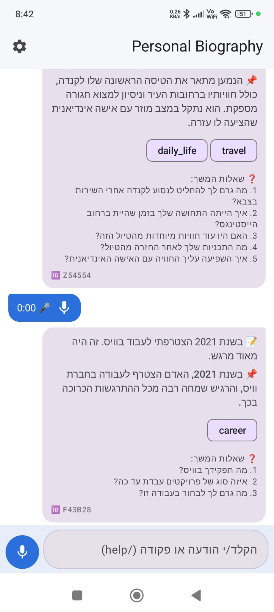
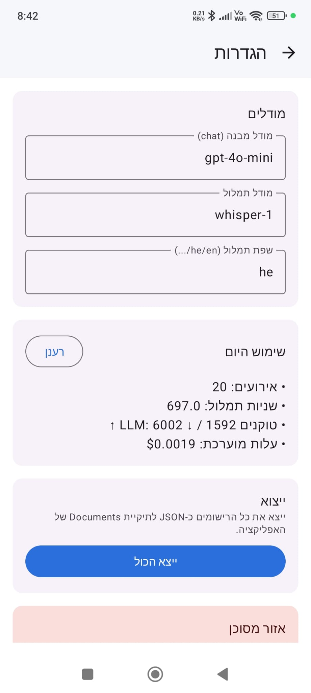
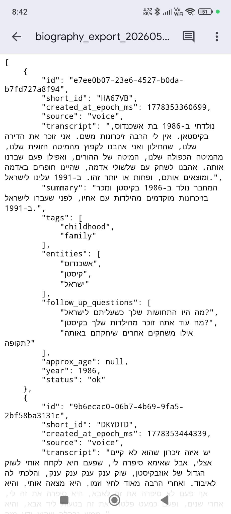

# Personal Biography (Android)

A native Android app that records Hebrew voice notes, transcribes them with
OpenAI Whisper, structures the transcript with GPT-4o-mini, and stores
everything locally in Room (SQLite). The UI is a single Telegram-style chat
screen.

This is a self-contained on-device port of the Telegram bot at
`/Users/igor/Documents/personal_biography/` — no backend, no Postgres, no
Vercel. The app calls OpenAI directly using a key stored in
`EncryptedSharedPreferences`.

## Demo

End-to-end run on a real device — record a Hebrew voice note, watch it
get transcribed by Whisper, structured by GPT-4o-mini, and land in the
chat as a saved entry with tags, entities, and follow-up questions.

<video src="docs/demo.mp4" controls width="320"></video>

If your viewer doesn't play inline video, the file is at
[`docs/demo.mp4`](docs/demo.mp4).

## Screenshots

<table>
  <tr>
    <td align="center">
      <br/>
      <sub>Chat — recorded entries with tags, entities, and follow-up questions</sub>
    </td>
    <td align="center">
      <br/>
      <sub>Settings — models, today's usage &amp; cost, export, danger zone</sub>
    </td>
    <td align="center">
      <br/>
      <sub>Export — pretty-printed JSON of all entries, on-device</sub>
    </td>
  </tr>
</table>

## Stack

- Kotlin 2.0 + Jetpack Compose (Material3)
- Room (SQLite) for entries + usage events
- Retrofit + OkHttp + kotlinx.serialization for OpenAI
- AndroidX Security (`EncryptedSharedPreferences`) for the OpenAI key
- MediaRecorder for audio capture (m4a / AAC)

## Prerequisites (macOS)

```bash
brew install openjdk@17 kotlin ktlint gradle
brew install --cask android-studio
```

Then in `~/.zshrc`:

```bash
export JAVA_HOME="/opt/homebrew/opt/openjdk@17"
export ANDROID_HOME="$HOME/Library/Android/sdk"
export PATH="$JAVA_HOME/bin:$ANDROID_HOME/platform-tools:$ANDROID_HOME/emulator:$ANDROID_HOME/cmdline-tools/latest/bin:$PATH"
```

Open Android Studio once, accept SDK licenses, install Android 35 platform
+ a system image, and create a Pixel emulator.

## Build & test

```bash
./gradlew :app:testDebugUnitTest      # JVM unit tests
./gradlew :app:assembleDebug          # build APK
./gradlew ktlintCheck                 # lint/format gate
```

The first run downloads Gradle, the Android Gradle Plugin, and all libraries
(≈300–500 MB) and is slow; subsequent runs are seconds. The debug APK is
signed with the local debug keystore at `~/.android/debug.keystore` (created
automatically the first time you build), so it installs without any Play
Store / signing setup.

The build output lands at:

```
app/build/outputs/apk/debug/app-debug.apk
```

If `assembleDebug` reports `BUILD SUCCESSFUL` in 1s with all tasks
`UP-TO-DATE`, Gradle reused the previous APK — that's fine, it's still
current. Force a fresh build with:

```bash
./gradlew :app:clean :app:assembleDebug
```

## Install on a phone

The app targets `minSdk = 26` (Android 8.0+). It is Android-only — it will
not run on iOS.

### Option A — wired (USB)

1. On the phone: `Settings → About phone → tap Build number 7 times` to
   enable Developer options.
2. `Settings → Developer options → enable USB debugging`.
3. Plug the phone into the Mac with a data-capable USB cable.
4. `adb devices` — accept the "Allow USB debugging from this computer?"
   prompt on the phone.
5. From the repo root:

   ```bash
   ./gradlew :app:installDebug    # build (if needed) + push + install
   ```

   Or install an existing APK:

   ```bash
   adb install -r app/build/outputs/apk/debug/app-debug.apk
   ```

### Option B — wireless adb (Android 11+, no cable)

Both machines must be on the same Wi-Fi.

1. On the phone: `Settings → Developer options → Wireless debugging → On`.
2. Tap **Pair device with pairing code**. Note the IP, port, and 6-digit
   code shown.
3. On the Mac:

   ```bash
   adb pair <ip>:<pairing_port>      # paste the 6-digit code
   adb connect <ip>:<connect_port>   # the port shown on the main
                                     # Wireless debugging screen — different
                                     # from the pairing port
   adb devices                       # confirm the device is listed
   ./gradlew :app:installDebug       # works wirelessly
   ```

   Subsequent sessions only need `adb connect <ip>:<port>` again.

### Option C — sideload the APK file (no developer mode)

Treat `app-debug.apk` like any other file and get it onto the phone:

- Upload to Google Drive / Dropbox / iCloud, download on the phone.
- Email or Telegram / Signal / WhatsApp it to yourself.
- Quick Share / Nearby Share from a Chromebook or another Android.

On the phone, tap the APK in the file manager. Android will say
*"…not allowed to install unknown apps from this source."* — tap
**Settings**, toggle **Allow from this source** for whichever app opened
the APK, back out, tap the APK again, **Install**.

### After install

1. Grant the microphone permission when prompted (`RECORD_AUDIO`, used by
   the voice recorder in `domain/AudioRecorder.kt`).
2. Open the in-app Settings, paste your OpenAI key (`sk-…`), Save. The key
   is written to `EncryptedSharedPreferences` (master key from the Android
   Keystore, AES-256-GCM at rest); see `data/secure/SecureSettings.kt`.
3. Start dictating. The pipeline (`domain/Pipeline.kt`) records audio →
   Whisper transcribes → GPT-4o-mini structures → Room stores the entry.

## Export your data

The app keeps everything on-device in Room. To pull entries off the phone
without a cable or root, use the built-in JSON export:

1. In-app: **Settings → ייצוא → ייצא הכול** (Export → Export all).
2. The card shows the saved path, e.g.:

   ```
   /storage/emulated/0/Android/data/com.personalbiography/files/Documents/biography_export_<timestamp>.json
   ```

3. On the phone, open the system Files app, navigate to
   `Internal storage → Android → data → com.personalbiography → files → Documents`,
   long-press the JSON, **Share** → Drive / email / Quick Share / etc.
4. With a USB cable, you can also pull every export at once:

   ```bash
   adb pull /sdcard/Android/data/com.personalbiography/files/Documents/ \
       ~/Desktop/biography-exports/
   ```

The export is a pretty-printed JSON array; each entry contains
`id`, `short_id`, `created_at_epoch_ms`, `source`, `transcript`,
`summary`, `tags`, `entities`, `follow_up_questions`, `approx_age`,
`year`, `status`. The OpenAI API key is **not** included by design; only
entries are exported. `android:allowBackup="false"` in the manifest means
`adb backup` returns an empty archive — the in-app export is the
supported way out.

## Layout

```
app/src/main/kotlin/com/personalbiography/
  data/db/        Room entities, DAOs, database
  data/remote/    OpenAI Retrofit client + DTOs
  data/repo/      EntryRepository, UsageRepository
  data/secure/    EncryptedSharedPreferences wrapper
  domain/         Pure business logic (no Android deps): Prompts,
                  Structuring, ShortId, Replies, Commands, Pipeline,
                  AudioRecorder
  ui/chat/        ChatScreen, ChatViewModel, bubbles, input bar
  ui/settings/    SettingsScreen
  ui/theme/       Material3 theme + RTL locale
```
